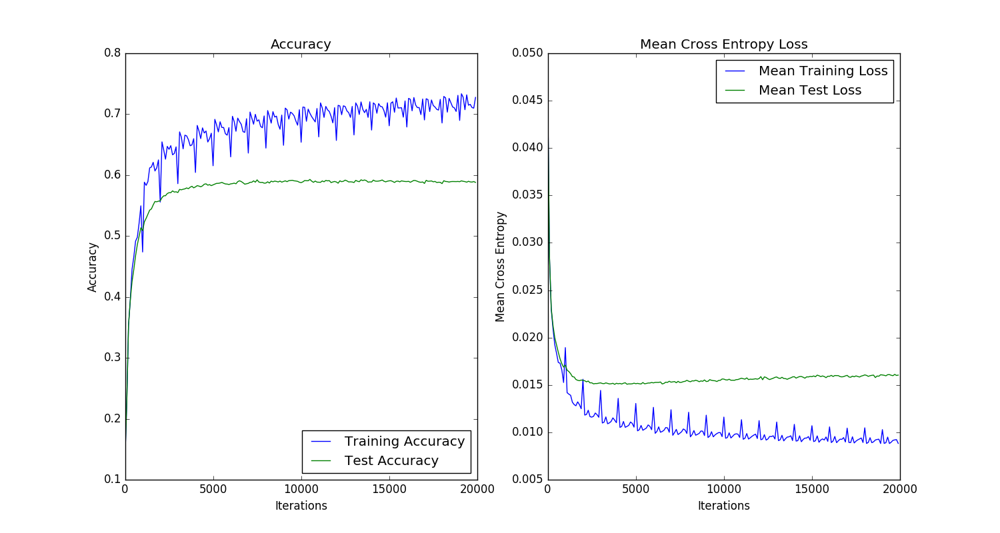

# Shakespeare RNN

A Tensorflow based RNN with GRU cells trained on Shakespeare's complete works.  This RNN is 3 layers deep with an internal size of 512.  It is trained on sequences of 30 characters pulled from Shakespeare's complete works.

## Output

Take a look at the [text generated from the trained RNN](./output/generated_shakespeare.txt).  Here's how the training and test error and cross entropy vary throughout the training iterations.

